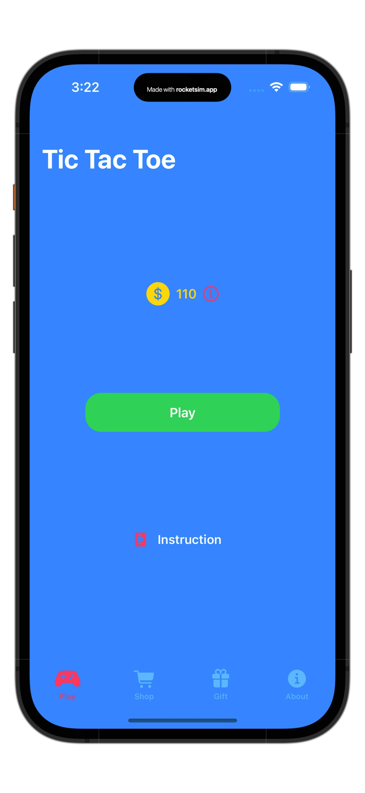
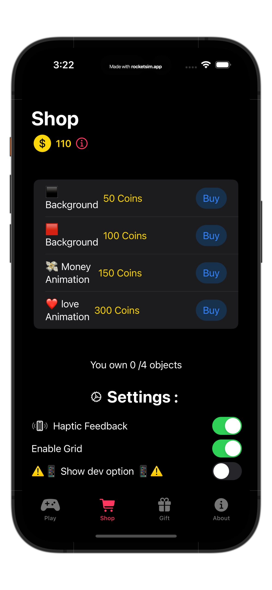
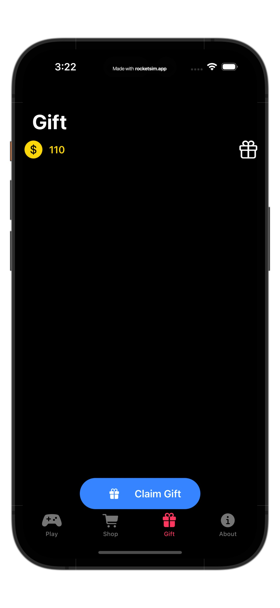
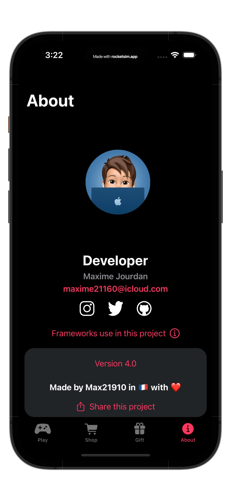
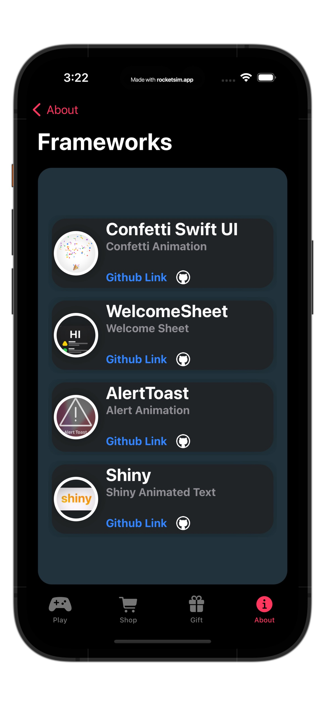
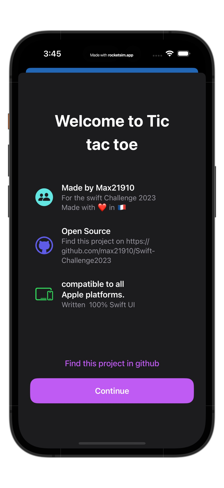
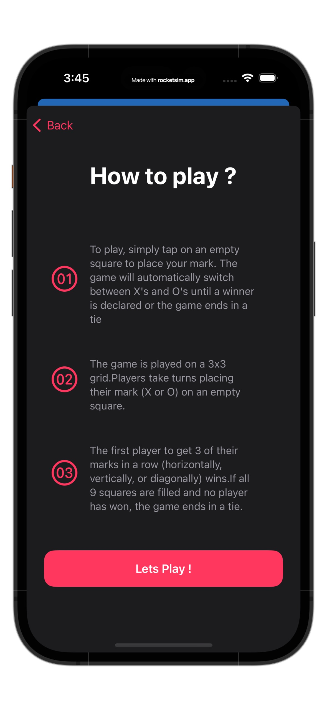
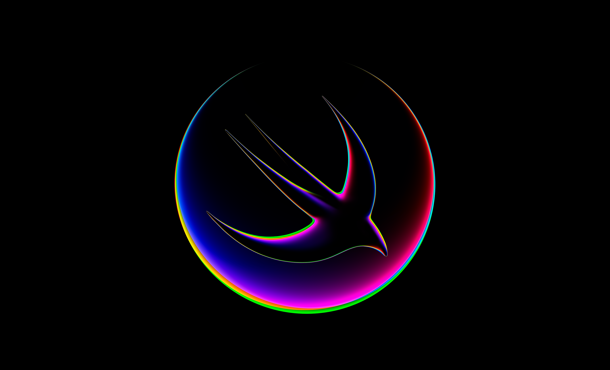

# Swift-Challenge2023

# Desciption :
my very first Swift challenge 
A simple Tic Tac Toe Game made with 100% Swift UI 

# Frameworks use in this project :

Welcome-Sheet: https://github.com/MAJKFL/Welcome-Sheet. 

ConfettiSwiftUI: https://github.com/simibac/ConfettiSwiftUI. 

AlertToast: https://github.com/elai950/AlertToast

Shiny: https://github.com/maustinstar/shiny

# Support :
📱 works from iOS 14 (older iOS not tested may work ) to iOS 16 

# Who made this :
Made with ❤️ by Max21910 in 🇫🇷

# Description
My 2023 swift challenge participation

## Free to use ?
yes this project is open source (please do not use this as a participation project for the 2023 swift challenge)
## Image :

